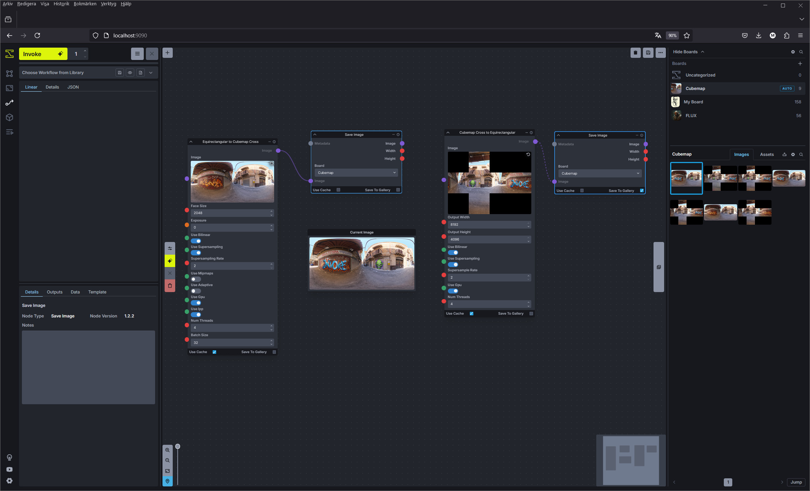
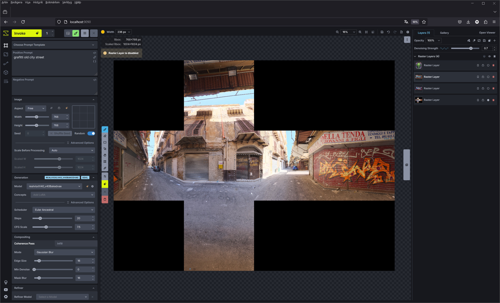
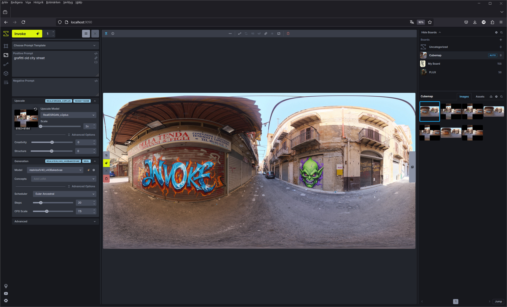

# Panorama Processing for InvokeAI

This package provides a growing set of tools for processing panoramic images within the InvokeAI framework. It enables conversion between equirectangular, cubemap, and cross-layout formats, with experimental support for both HDR and LDR image processing.

## Features

The package includes several key components for panorama processing:

### Format Conversion
- Equirectangular to Cubemap (individual faces)
- Equirectangular to Cross-layout Cubemap
- Cross-layout Cubemap to Equirectangular
- LDR to HDR conversion with OpenEXR support

### Advanced Processing Options
- Multiple anti-aliasing methods:
  - Bilinear interpolation
  - Supersampling (up to 16x)
  - Mipmap filtering
  - Adaptive sampling based on image content
- HDR processing with exposure control
- GPU acceleration using CUDA
- Multi-threaded CPU processing
- Intel IPP optimizations

## Installation

The package is designed to be used within the InvokeAI framework. Ensure you have the following dependencies installed:

```bash
pip install numpy pillow opencv-python openexr
```

For GPU acceleration, ensure you have CUDA support installed with OpenCV.

## Usage
Workflow view. Convert to/from Equirectangular/Cubemap Cross


Canvas view. Edit the image without distortion



Before

After


## Technical Details

### Coordinate Systems

The package handles several coordinate systems:

1. Equirectangular (spherical coordinates):
   - Latitude: -π/2 to π/2
   - Longitude: -π to π

2. Cubemap faces (normalized coordinates):
   - Each face uses [-1, 1] × [-1, 1] coordinate space
   - Face orientations follow OpenGL conventions

3. Cross layout:
   ```
       [U]
   [L][F][R][B]
       [D]
   ```
   Where: F=Front, B=Back, L=Left, R=Right, U=Up, D=Down

### Anti-aliasing Methods

The package implements several anti-aliasing techniques:

1. Bilinear Interpolation
   - Smooth sampling between pixels
   - Good balance of quality and performance

2. Supersampling
   - Multiple samples per pixel
   - Rates: 2x2, 3x3, or 4x4 samples
   - Higher quality but more computationally intensive

3. Mipmap Filtering
   - Pre-filtered image pyramids
   - Automatic level selection based on sampling rate
   - Reduces aliasing for minification

4. Adaptive Sampling
   - Analyzes image content for edge detection
   - Increases sample density in high-frequency areas
   - Optimizes processing resources

### Performance Optimizations

The codebase includes several optimization strategies:

1. GPU Acceleration
   - CUDA support through OpenCV
   - Parallel processing of image batches
   - Efficient memory management

2. CPU Optimizations
   - Multi-threaded processing
   - Intel IPP integration
   - Vectorized operations using NumPy
   - Efficient array slicing and batch processing

3. Memory Management
   - Streaming large images
   - Batch processing for GPU operations
   - Efficient coordinate pre-calculation
